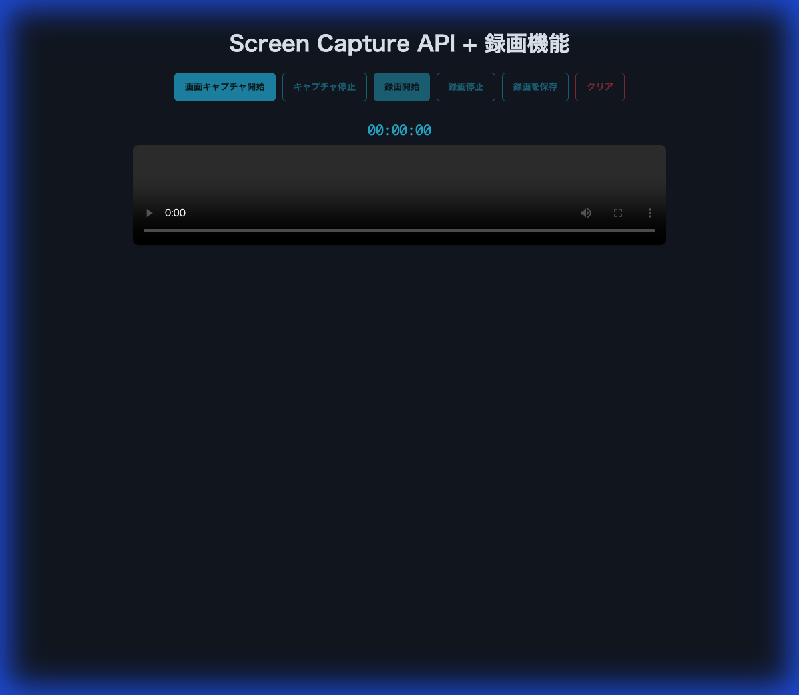

# Screen Capture Recorder

---

ブラウザだけで動作する、シンプルかつ高機能な画面キャプチャ・録画ツールです。
HTMLファイル1つで完結しており、サーバーへのデータ送信は一切行いません。

## 特徴

- **堅牢なコーデックサポート**: ブラウザがサポートする最適なビデオコーデック（VP9, VP8, H.264など）を自動的に検出して使用します。
- **使いやすいUI**:
    - 録画タイマー表示
    - 分かりやすいステータス通知
    - モダンなダークテーマ
    - リセット機能（クリアボタン）
- **プライバシー重視**: すべての処理がローカル（ブラウザ内）で完結します。

## 使い方

1.  **ファイルを開く**:
    `index.html` をモダンブラウザ（Chrome, Edge, Firefoxなど）で開きます。
    （GitHub Pagesで公開している場合は、そのURLにアクセスするだけです）

2.  **キャプチャ開始**:
    「画面キャプチャ開始」ボタンをクリックし、共有・録画したい画面やウィンドウを選択します。

3.  **録画**:
    - 「録画開始」ボタンで録画をスタートします。
    - 必要な操作を行った後、「録画停止」ボタンをクリックします。

4.  **保存**:
    「録画を保存」ボタンをクリックすると、WebM形式の動画ファイルとしてダウンロードされます。

5.  **リセット**:
    「クリア」ボタンをクリックすると、プレビューと録画データがリセットされ、初期状態に戻ります。

## 動作環境

- Google Chrome (推奨)
- Microsoft Edge
- Mozilla Firefox
- その他、Screen Capture API と MediaRecorder API をサポートするブラウザ

---
